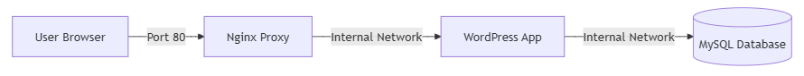

# Automasi Deployment VM IDCloudHost dengan Cloud-Init

## 📋 Deskripsi

Project ini adalah solusi automasi untuk deployment Virtual Machine (VM) di IDCloudHost menggunakan fitur **User Data** (Cloud-Init) melalui GUI Dashboard. 

Script ini secara otomatis akan melakukan deployment **WordPress Stack berbasis Docker** saat VM pertama kali boot, termasuk:
- Instalasi Docker Engine
- Setup Docker Network
- Deployment container MySQL (Database)
- Deployment container WordPress (Aplikasi)
- Deployment container Nginx (Reverse Proxy)

Dengan menggunakan fitur Cloud-Init, Anda tidak perlu melakukan konfigurasi manual setelah VM dibuat. Semua proses instalasi dan setup akan berjalan otomatis dalam beberapa menit setelah VM pertama kali dinyalakan.

---

## ⏱️ Estimasi Waktu Deployment

Proses deployment otomatis membutuhkan waktu **5-15 menit** tergantung:
- Kecepatan koneksi internet untuk download Docker images (~500MB total)
- Spesifikasi VM (CPU, RAM, Disk I/O)
- Proses inisialisasi database MySQL

**Timeline perkiraan:**
- **0-2 menit**: Instalasi Docker
- **2-8 menit**: Download Docker images (MySQL, WordPress, Nginx)
- **8-12 menit**: Pembuatan dan inisialisasi container
- **12-15 menit**: WordPress siap digunakan

> **Tips:** Gunakan `watch docker ps` atau `docker ps -a` untuk memantau progress container secara real-time. Jangan terlalu cepat mengecek status, berikan waktu beberapa menit untuk proses download dan inisialisasi selesai.

---

## 📂 Struktur File

| Nama File | Deskripsi |
|-----------|-----------|
| `stack-app.sh` | **Payload Aplikasi** - Script ini berisi logika bisnis utama untuk deployment stack aplikasi. Script ini membuat Docker Network, menjalankan container MySQL, WordPress, dan Nginx sebagai Reverse Proxy. Script ini akan di-download dari sumber eksternal (GitHub/Gist) saat VM pertama kali boot. |
| `setup-vm.sh` | **Installer/Cloud-Init Script** - Script ini adalah entry-point yang akan ditanamkan ke VM melalui fitur User Data. Script ini bertugas menyiapkan environment (menginstall Docker), melakukan login ke Private Registry (simulasi), mendownload `stack-app.sh` dari URL eksternal, dan mengeksekusinya. |

---

## 🏗️ Arsitektur

Berikut adalah diagram alur traffic dan arsitektur stack aplikasi yang akan ter-deploy:



**Penjelasan Arsitektur:**
- **User Browser** mengakses website melalui Port 80 (HTTP)
- **Nginx** bertindak sebagai Reverse Proxy yang meneruskan request ke container WordPress
- **WordPress** container berkomunikasi dengan **MySQL** container melalui Docker Network internal
- Semua container berjalan dalam Docker Network yang sama (`wp-network`) untuk memungkinkan komunikasi menggunakan service discovery (nama container)

---

## 🚀 Panduan Penggunaan (Step-by-Step)

### Langkah 1: Upload Script Aplikasi ke GitHub/Gist

1. Pastikan file `stack-app.sh` sudah tersedia di repository lokal Anda
2. Upload file `stack-app.sh` ke:
   - **GitHub Repository** (public), atau
   - **GitHub Gist** (lebih cepat dan praktis)
3. Setelah file ter-upload, klik tombol **"Raw"** untuk melihat konten file dalam format raw
4. **Salin URL** dari browser address bar
   - Format URL GitHub: `https://raw.githubusercontent.com/username/repo/branch/stack-app.sh`
   - Format URL Gist: `https://gist.githubusercontent.com/username/gist-id/raw/stack-app.sh`

> **Catatan:** Pastikan URL yang Anda salin adalah URL **Raw**, bukan URL halaman web biasa.

---

### Langkah 2: Edit Script Installer

1. Buka file `setup-vm.sh` menggunakan text editor favorit Anda
2. Cari variabel `URL_SCRIPT_APLIKASI` di bagian atas file
3. Ganti nilai variabel tersebut dengan URL Raw yang Anda salin di Langkah 1

```bash
URL_SCRIPT_APLIKASI="https://raw.githubusercontent.com/username/repo/main/stack-app.sh"
```

4. (Opsional) Jika diperlukan, sesuaikan juga variabel untuk Docker Registry:
   - `REGISTRY_URL`
   - `REG_USER`
   - `REG_PASS`

5. Simpan perubahan file

---

### Langkah 3: Encode Script ke Base64

Agar script dapat dimasukkan ke kolom User Data di Dashboard IDCloudHost, script `setup-vm.sh` harus di-encode menjadi format Base64.

#### Opsi A: Menggunakan Website Online

1. Buka website [base64encode.org](https://www.base64encode.org/) atau tool Base64 encoder lainnya
2. Copy seluruh isi file `setup-vm.sh` yang sudah diedit
3. Paste ke kolom input pada website
4. Klik tombol "Encode" atau "Convert"
5. **Salin string Base64** yang dihasilkan

#### Opsi B: Menggunakan Terminal/Command Line

**Linux/Mac:**
```bash
cat setup-vm.sh | base64
```

**Windows PowerShell:**
```powershell
[Convert]::ToBase64String([System.Text.Encoding]::UTF8.GetBytes([System.IO.File]::ReadAllText("setup-vm.sh")))
```

**Windows Command Prompt:**
```cmd
certutil -encode setup-vm.sh encoded.txt
type encoded.txt
```

> **Penting:** Pastikan string Base64 yang dihasilkan tidak mengandung line breaks atau spasi tambahan. Jika ada, hapus semua line breaks sebelum digunakan.

---

### Langkah 4: Deploy di Dashboard IDCloudHost

1. **Login** ke Dashboard IDCloudHost Console
2. Klik menu untuk **membuat VM baru** atau **Create Virtual Machine**
3. Isi konfigurasi dasar VM (OS, spesifikasi, dll) sesuai kebutuhan
4. Scroll ke bagian **"Initialization script"** atau **"User Data"**
5. **Centang (Check)** opsi: **"Add custom configuration for the virtual machine"**
6. Masukkan konfigurasi berikut ke kolom teks yang muncul:

```yaml
#cloud-config
write_files:
  - path: /root/setup-vm.sh
    permissions: '0755'
    encoding: b64
    content: |
      PASTE_STRING_BASE64_ANDA_DISINI

runcmd:
  - /root/setup-vm.sh
```

7. Ganti `PASTE_STRING_BASE64_ANDA_DISINI` dengan string Base64 yang Anda dapatkan di Langkah 3
8. Klik tombol **"Create"** atau **"Deploy"** untuk membuat VM
9. Tunggu **3-5 menit** setelah VM menyala agar proses instalasi otomatis selesai
10. Setelah selesai, akses website melalui IP Public VM pada Port 80

> **Tips:** Anda dapat memantau proses instalasi dengan melakukan SSH ke VM dan menjalankan perintah `tail -f /var/log/cloud-init-output.log`

---

## 🔍 Monitoring Deployment Progress

Setelah VM dibuat, Anda dapat memantau progress deployment dengan berbagai cara:

### Melihat Log Cloud-Init

```bash
# Melihat log lengkap Cloud-Init
tail -f /var/log/cloud-init-output.log

# Atau melihat log dengan jumlah baris tertentu
tail -n 100 /var/log/cloud-init-output.log
```

### Melihat Status Container

```bash
# Real-time monitoring (update setiap 2 detik)
watch docker ps

# Atau sekali saja untuk melihat status
docker ps -a

# Melihat container yang sedang running
docker ps

# Melihat semua container termasuk yang stopped
docker ps -a
```

### Melihat Log Container Spesifik

```bash
# MySQL logs
docker logs db-mysql

# WordPress logs
docker logs app-wordpress

# Nginx logs
docker logs web-nginx

# Follow logs secara real-time
docker logs -f app-wordpress
```

### Cek Apakah Website Sudah Ready

```bash
# Test dari dalam VM
curl http://localhost

# Atau dengan IP address
curl http://$(hostname -I | awk '{print $1}')

# Test dengan verbose untuk melihat response
curl -v http://localhost
```

### Melihat Resource Usage

```bash
# Melihat penggunaan resource container
docker stats

# Melihat disk usage
docker system df
```

### Troubleshooting

Jika container tidak running, cek dengan:

```bash
# Cek status semua container
docker ps -a

# Cek log error
docker logs <container-name>

# Restart container yang stopped
docker start <container-name>

# Cek network
docker network ls
docker network inspect wp-network
```

---

## ⚠️ Catatan Keamanan

### Hardcoded Credentials

⚠️ **PENTING:** Script `stack-app.sh` menggunakan password database yang ditulis langsung di dalam file (hardcoded) untuk tujuan demonstrasi dan kemudahan testing.

**Contoh credentials yang digunakan:**
- MySQL Root Password: `PasswordRootSangatRahasia`
- MySQL Database: `wordpress_db`
- MySQL User: `wp_user`
- MySQL User Password: `PasswordUserWp123`

**JANGAN gunakan credentials ini di production environment!**

**Rekomendasi untuk Production:**
- Gunakan **Docker Secrets** atau **Environment Variables** yang aman
- Simpan credentials di **Vault** atau **Secret Management System**
- Gunakan **random password generator** untuk membuat password yang kuat
- Jangan commit credentials ke repository public

### User Data Visibility

Data yang dimasukkan ke kolom User Data (Cloud-Init) dapat dibaca dari dalam VM melalui file `/var/lib/cloud/instance/user-data.txt`. Oleh karena itu:

- **Jangan** menaruh kredensial sensitif permanen di User Data
- Gunakan User Data hanya untuk konfigurasi awal atau untuk mendownload script dari sumber yang aman
- Untuk data sensitif, gunakan mekanisme lain seperti **Cloud Secrets Manager** atau **encrypted storage**

---

## 📝 Lisensi

Project ini dibuat untuk tujuan edukasi dan demonstrasi penggunaan fitur User Data (Cloud-Init) pada Console IDCloudHost.

---

## 🤝 Kontribusi

Silakan lakukan Fork dan Pull Request jika ingin menambahkan fitur lain atau memperbaiki script.

---

**Disclaimer:** Tutorial ini dibuat untuk tujuan edukasi. Penggunaan di production environment memerlukan penyesuaian keamanan yang lebih ketat.
